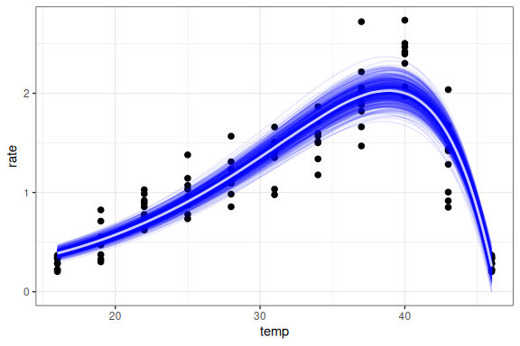
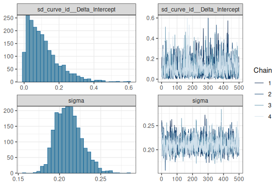
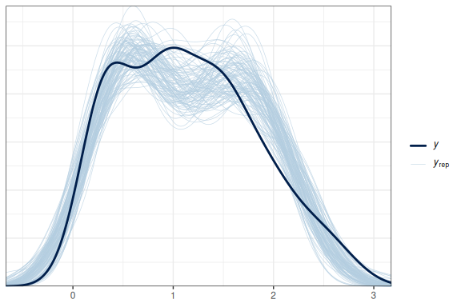
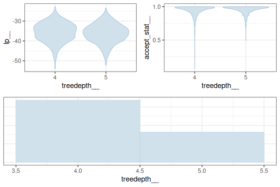
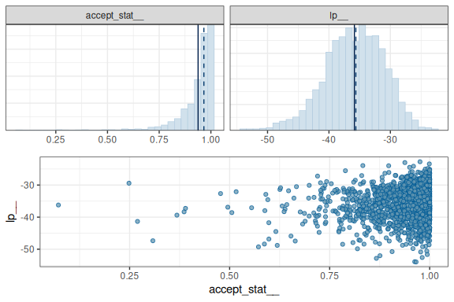

# Hierarchical Universal Thermal Performance Curves

## Introduction

``` r
library(rTPC)
library(tidyverse)
```

    ## ── Attaching core tidyverse packages ──────────────────────── tidyverse 2.0.0 ──
    ## ✔ dplyr     1.1.4     ✔ readr     2.1.6
    ## ✔ forcats   1.0.1     ✔ stringr   1.6.0
    ## ✔ ggplot2   4.0.1     ✔ tibble    3.3.0
    ## ✔ lubridate 1.9.4     ✔ tidyr     1.3.1
    ## ✔ purrr     1.2.0     
    ## ── Conflicts ────────────────────────────────────────── tidyverse_conflicts() ──
    ## ✖ dplyr::filter() masks stats::filter()
    ## ✖ dplyr::lag()    masks stats::lag()
    ## ℹ Use the conflicted package (<http://conflicted.r-lib.org/>) to force all conflicts to become errors

``` r
library(ggrepel)
theme_set(theme_bw())

# Prepare for Stan and brms 
library(brms)
```

    ## Loading required package: Rcpp
    ## Loading 'brms' package (version 2.23.0). Useful instructions
    ## can be found by typing help('brms'). A more detailed introduction
    ## to the package is available through vignette('brms_overview').
    ## 
    ## Attaching package: 'brms'
    ## 
    ## The following object is masked from 'package:stats':
    ## 
    ##     ar

``` r
options(brms.backend = "cmdstanr")
library(marginaleffects)
library(ggdist)
```

    ## 
    ## Attaching package: 'ggdist'
    ## 
    ## The following objects are masked from 'package:brms':
    ## 
    ##     dstudent_t, pstudent_t, qstudent_t, rstudent_t

## Section 1

``` r
## get curve data
data("chlorella_tpc")

d_hier <- filter(
  chlorella_tpc,
  process == 'adaptation',
  growth_temp %in% c(27, 30, 33),
  flux == 'photosynthesis'
) %>%
  mutate(curve_id = as.factor(curve_id)) %>%
  as_tibble()
d_hier
```

    ## # A tibble: 96 × 6
    ##    curve_id growth_temp process    flux            temp  rate
    ##    <fct>          <dbl> <chr>      <chr>          <dbl> <dbl>
    ##  1 52                27 adaptation photosynthesis    16 0.332
    ##  2 52                27 adaptation photosynthesis    19 0.550
    ##  3 52                27 adaptation photosynthesis    22 0.856
    ##  4 52                27 adaptation photosynthesis    25 1.14 
    ##  5 52                27 adaptation photosynthesis    28 1.57 
    ##  6 52                27 adaptation photosynthesis    31 1.50 
    ##  7 52                27 adaptation photosynthesis    34 1.51 
    ##  8 52                27 adaptation photosynthesis    37 1.92 
    ##  9 52                27 adaptation photosynthesis    40 2.42 
    ## 10 52                27 adaptation photosynthesis    43 1.42 
    ## # ℹ 86 more rows

``` r
d_hier %>%
  ggplot() +
  geom_point(aes(temp, rate, size = growth_temp), fill = 'green4') +
  geom_line(aes(temp, rate, group = curve_id)) +
  theme_bw(base_size = 12) +
  theme(
    strip.text = element_text(hjust = 0),
    strip.background = element_blank()
  ) +
  labs(
    x = 'Temperature (ºC)',
    y = 'Metabolic rate',
    title = 'Photosynthesis rates across temperatures'
  ) +
  geom_hline(aes(yintercept = 0), linetype = 2)
```

<!-- -->

## Section 2

``` r
# Model -------------------------------------------------------------------

# See https://github.com/AndrewLJackson/UTPC-paper/blob/main/import-fit-merge.Rmd#L132C9-L132C68

# performance ~ (yopt * exp( (ta - Topt)/Delta ) * (1 - (ta - Topt)/Delta))
# ta = temp in Celcius!

bform <- bf(
  rate ~ yopt * exp((temp - Topt) / Delta) * (1 - (temp - Topt) / Delta),
  yopt ~ 1 + (1 | curve_id),
  Topt ~ 1 + (1 | curve_id),
  Delta ~ 1 + (1 | curve_id),
  nl = TRUE
)

priors <- c(
  prior(normal(2, 0.25), lb = 0, nlpar = "yopt"),
  prior(normal(0, 3), lb = 0, ub = 20, nlpar = "Delta"),
  prior(normal(40, 3), lb = 30, ub = 50, nlpar = "Topt"),
  prior(normal(0, 0.3), lb = 0, class = "sd", nlpar = "yopt"),
  prior(std_normal(), lb = 0, class = "sd", nlpar = "Topt"),
  prior(normal(0, 0.3), lb = 0, class = "sd", nlpar = "Delta"),
  prior(normal(0, 0.1), lb = 0, class = "sigma")
)


m_UTPC <- brm(
  bform,
  family = brmsfamily("gaussian"),
  data = d_hier,
  prior = priors,
  # sample_prior = "only",
  control = list(adapt_delta = 0.9, max_treedepth = 12),
  cores = 4,
  iter = 1000,
  backend = "cmdstanr",
  seed = 42
)
```

    ## Start sampling

    ## Running MCMC with 4 parallel chains...
    ## 
    ## Chain 1 Iteration:   1 / 1000 [  0%]  (Warmup) 
    ## Chain 2 Iteration:   1 / 1000 [  0%]  (Warmup) 
    ## Chain 3 Iteration:   1 / 1000 [  0%]  (Warmup) 
    ## Chain 4 Iteration:   1 / 1000 [  0%]  (Warmup) 
    ## Chain 1 Iteration: 100 / 1000 [ 10%]  (Warmup) 
    ## Chain 2 Iteration: 100 / 1000 [ 10%]  (Warmup) 
    ## Chain 3 Iteration: 100 / 1000 [ 10%]  (Warmup) 
    ## Chain 4 Iteration: 100 / 1000 [ 10%]  (Warmup) 
    ## Chain 1 Iteration: 200 / 1000 [ 20%]  (Warmup) 
    ## Chain 2 Iteration: 200 / 1000 [ 20%]  (Warmup) 
    ## Chain 2 Iteration: 300 / 1000 [ 30%]  (Warmup) 
    ## Chain 3 Iteration: 200 / 1000 [ 20%]  (Warmup) 
    ## Chain 3 Iteration: 300 / 1000 [ 30%]  (Warmup) 
    ## Chain 4 Iteration: 200 / 1000 [ 20%]  (Warmup) 
    ## Chain 1 Iteration: 300 / 1000 [ 30%]  (Warmup) 
    ## Chain 1 Iteration: 400 / 1000 [ 40%]  (Warmup) 
    ## Chain 1 Iteration: 500 / 1000 [ 50%]  (Warmup) 
    ## Chain 1 Iteration: 501 / 1000 [ 50%]  (Sampling) 
    ## Chain 2 Iteration: 400 / 1000 [ 40%]  (Warmup) 
    ## Chain 2 Iteration: 500 / 1000 [ 50%]  (Warmup) 
    ## Chain 2 Iteration: 501 / 1000 [ 50%]  (Sampling) 
    ## Chain 2 Iteration: 600 / 1000 [ 60%]  (Sampling) 
    ## Chain 3 Iteration: 400 / 1000 [ 40%]  (Warmup) 
    ## Chain 3 Iteration: 500 / 1000 [ 50%]  (Warmup) 
    ## Chain 3 Iteration: 501 / 1000 [ 50%]  (Sampling) 
    ## Chain 4 Iteration: 300 / 1000 [ 30%]  (Warmup) 
    ## Chain 4 Iteration: 400 / 1000 [ 40%]  (Warmup) 
    ## Chain 4 Iteration: 500 / 1000 [ 50%]  (Warmup) 
    ## Chain 4 Iteration: 501 / 1000 [ 50%]  (Sampling) 
    ## Chain 1 Iteration: 600 / 1000 [ 60%]  (Sampling) 
    ## Chain 2 Iteration: 700 / 1000 [ 70%]  (Sampling) 
    ## Chain 2 Iteration: 800 / 1000 [ 80%]  (Sampling) 
    ## Chain 3 Iteration: 600 / 1000 [ 60%]  (Sampling) 
    ## Chain 3 Iteration: 700 / 1000 [ 70%]  (Sampling) 
    ## Chain 4 Iteration: 600 / 1000 [ 60%]  (Sampling) 
    ## Chain 1 Iteration: 700 / 1000 [ 70%]  (Sampling) 
    ## Chain 1 Iteration: 800 / 1000 [ 80%]  (Sampling) 
    ## Chain 2 Iteration: 900 / 1000 [ 90%]  (Sampling) 
    ## Chain 2 Iteration: 1000 / 1000 [100%]  (Sampling) 
    ## Chain 3 Iteration: 800 / 1000 [ 80%]  (Sampling) 
    ## Chain 3 Iteration: 900 / 1000 [ 90%]  (Sampling) 
    ## Chain 4 Iteration: 700 / 1000 [ 70%]  (Sampling) 
    ## Chain 4 Iteration: 800 / 1000 [ 80%]  (Sampling) 
    ## Chain 2 finished in 1.0 seconds.
    ## Chain 1 Iteration: 900 / 1000 [ 90%]  (Sampling) 
    ## Chain 1 Iteration: 1000 / 1000 [100%]  (Sampling) 
    ## Chain 3 Iteration: 1000 / 1000 [100%]  (Sampling) 
    ## Chain 4 Iteration: 900 / 1000 [ 90%]  (Sampling) 
    ## Chain 4 Iteration: 1000 / 1000 [100%]  (Sampling) 
    ## Chain 1 finished in 1.2 seconds.
    ## Chain 3 finished in 1.1 seconds.
    ## Chain 4 finished in 1.1 seconds.
    ## 
    ## All 4 chains finished successfully.
    ## Mean chain execution time: 1.1 seconds.
    ## Total execution time: 1.3 seconds.

    ## Loading required namespace: rstan

``` r
m_UTPC
```

    ##  Family: gaussian 
    ##   Links: mu = identity 
    ## Formula: rate ~ yopt * exp((temp - Topt)/Delta) * (1 - (temp - Topt)/Delta) 
    ##          yopt ~ 1 + (1 | curve_id)
    ##          Topt ~ 1 + (1 | curve_id)
    ##          Delta ~ 1 + (1 | curve_id)
    ##    Data: d_hier (Number of observations: 96) 
    ##   Draws: 4 chains, each with iter = 1000; warmup = 500; thin = 1;
    ##          total post-warmup draws = 2000
    ## 
    ## Multilevel Hyperparameters:
    ## ~curve_id (Number of levels: 9) 
    ##                     Estimate Est.Error l-95% CI u-95% CI Rhat Bulk_ESS Tail_ESS
    ## sd(yopt_Intercept)      0.28      0.08     0.16     0.48 1.01      775     1249
    ## sd(Topt_Intercept)      0.11      0.09     0.00     0.34 1.00     1226      934
    ## sd(Delta_Intercept)     0.11      0.09     0.01     0.34 1.00     1420     1270
    ## 
    ## Regression Coefficients:
    ##                 Estimate Est.Error l-95% CI u-95% CI Rhat Bulk_ESS Tail_ESS
    ## yopt_Intercept      2.03      0.10     1.84     2.24 1.00      668     1046
    ## Topt_Intercept     38.88      0.17    38.54    39.21 1.00     1619     1403
    ## Delta_Intercept     7.49      0.18     7.13     7.85 1.00     1514     1306
    ## 
    ## Further Distributional Parameters:
    ##       Estimate Est.Error l-95% CI u-95% CI Rhat Bulk_ESS Tail_ESS
    ## sigma     0.21      0.02     0.18     0.25 1.00     1841     1445
    ## 
    ## Draws were sampled using sample(hmc). For each parameter, Bulk_ESS
    ## and Tail_ESS are effective sample size measures, and Rhat is the potential
    ## scale reduction factor on split chains (at convergence, Rhat = 1).

``` r
plot(
  conditional_effects(m_UTPC, effects = "temp", spaghetti = T, ndraws = 500),
  points = T
)
```

    ## Ignoring unknown labels:
    ## • colour : "NA"

    ## Ignoring unknown labels:
    ## • colour : "NA"

<!-- -->

``` r
plot(m_UTPC, ask = F)
```

<!-- --><!-- -->

``` r
pp_check(m_UTPC, ndraws = 100)
```

<!-- -->

``` r
mcmc_plot(m_UTPC, type = "nuts_treedepth")
```

<!-- --><!-- -->

``` r
mcmc_plot(m_UTPC, type = "nuts_acceptance")
```

    ## `stat_bin()` using `bins = 30`. Pick better value `binwidth`.

<!-- -->

``` r
mcmc_plot(m_UTPC, type = "nuts_stepsize")
```

<!-- -->

## Section 3
