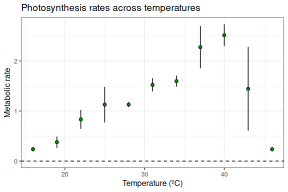
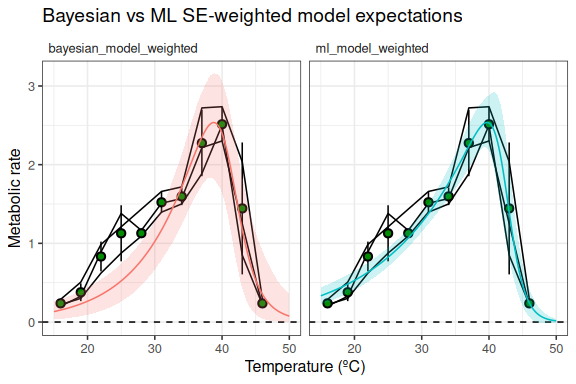
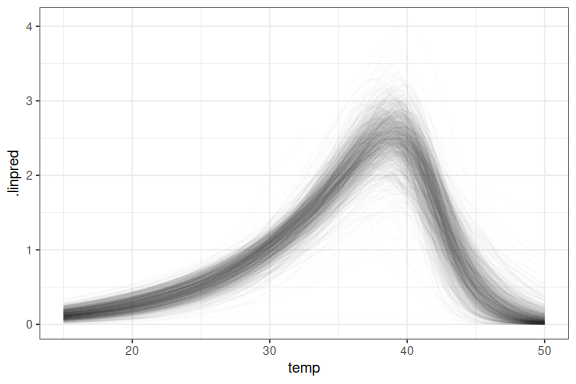
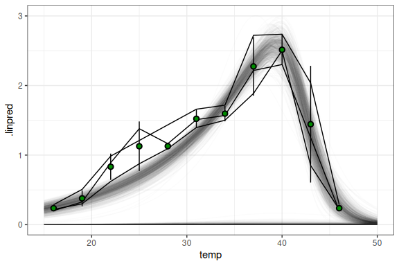
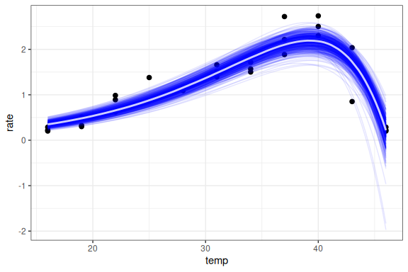
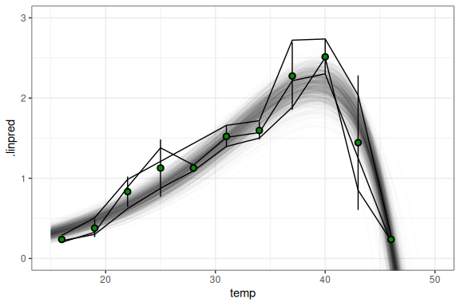
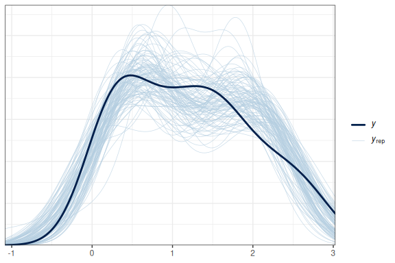
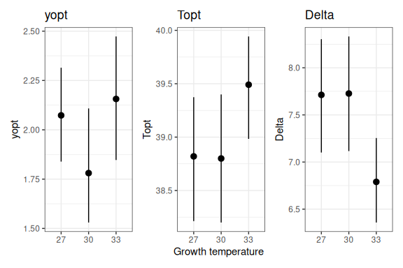
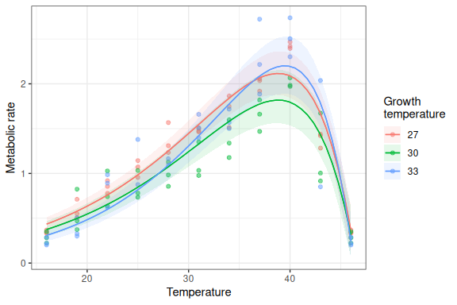

# Hierarchical Universal Thermal Performance Curves

## Introduction

A while back (around May 2025) I got interested in thermal performance
curves after seeing several interesting presentations at a SEEC
symposium by students of Prof. Susana Clusella-Trullas's. One student
had fit a plethora of models, both convenetional and otherwise, and
found it difficult to decide which was "best". Much reference was made
to a paper claiming that there was no "one size fits all" model for this
sort of data (<https://www.nature.com/articles/s41467-024-53046-2>).

### Background

A bit of background: thermal performance curves (TPCs) are descriptions
of how well organisms perform under a range of temperatures. This is
usually assessed experimentally (though in some cases one could use
observational data). Performance is a relatively vague concept, but it
is intended to serve as an indicator of fitness potential. As such, it
can be measured in a number of ways, many of which are particular to the
organism under study, and most of which are some kind of rate. In
plants, one might measure growth or photosynthetic rate; in bacteria,
one might measure colony growth; in animals, movement speed and
metabolic rate are frequently used.

It occurred to me that many TPC experiments produce data with a
hierarchical structure. For example, in many cases the same individual
is measured across the full range of assay temperatures. In other
instances, one might have several blocks representing each temperature
treatment, with a number of individuals measured in each. Such structure
should be taken into account when modelling. To my surprise, however,
according to my (admittedly somewhat shallow) research, this did not
appear to be the norm. Instead, when multiple measurements are taken per
individual the standard approach appears to be to fit a separate model
to each individual and discard individuals with "too few data points" or
for which the model fails to converge. And when individuals are only
measured once but multiple individuals are measured per treatment, their
performance values are often averaged as a way of accounting for uneven
sampling effort.

Many mathematical models have been proposed to describe the types of
TPCs typically encountered. Most of them follow the same basic form: at
low temperatures, performance is poor; then, it ramps up exponentially,
plateauing just before reaching a peak; finally performance takes a
nose-dive, steeply dropping before reaching zero at the critical upper
thermal limit. In the paper I mentioned above, Kontopoulos et al. fit 83
of these models to each of 2,739 TPC data sets and found that none of
the models consistently outperformed the others. Many if not most of
these models are implemented in the comprehensive and widely used R
package `rTPC`
(<https://padpadpadpad.github.io/rTPC/reference/index.html>), whose
documentation includes a number of vignettes on using the `rTPC`
functions alongside the `nls.multstart` package for model fitting by
maximum likelihood. One thing that's missing is mention of how to
explicitly account for the hierarchical nature of many TPC data sets.
Instead, recommendations for such data include, for example, i) fitting
TPCs independently to each individual when the same individual is
measured across the full range of assay temperatures
([here](https://padpadpadpad.github.io/rTPC/articles/fit_many_curves.html));
ii) using the mean for each temperature but using inverse standard
deviation weighting to account for measurement error
(<https://padpadpadpad.github.io/rTPC/articles/model_weighting.html>);
and iii) complicated bootstrapping methods to approximate uncertainty
intervals
(<https://padpadpadpad.github.io/rTPC/articles/weighted_bootstrapping.html>).

I strongly suspected that a Bayesian hierarchical approach could do all
of these things much more elegantly. To test this idea, I tried to
replicate some of the examples presented in the `rTPC` vignettes in a
Bayesian framework, and then adapt them to the hierarchical way of doing
things. I used the brilliant `brms` R package for all my model
specification, fitting (using Stan), and post-processing needs. This
package makes all of these things easy, and its straightforward syntax
for non-linear formulae and prior specifications came in particularly
clutch.

``` r
set.seed(42)
library(rTPC)
library(tidyverse)
```

    ## ── Attaching core tidyverse packages ──────────────────────── tidyverse 2.0.0 ──
    ## ✔ dplyr     1.1.4     ✔ readr     2.1.6
    ## ✔ forcats   1.0.1     ✔ stringr   1.6.0
    ## ✔ ggplot2   4.0.1     ✔ tibble    3.3.0
    ## ✔ lubridate 1.9.4     ✔ tidyr     1.3.1
    ## ✔ purrr     1.2.0     
    ## ── Conflicts ────────────────────────────────────────── tidyverse_conflicts() ──
    ## ✖ dplyr::filter() masks stats::filter()
    ## ✖ dplyr::lag()    masks stats::lag()
    ## ℹ Use the conflicted package (<http://conflicted.r-lib.org/>) to force all conflicts to become errors

``` r
library(ggrepel)
theme_set(theme_bw())

# Prepare for Stan and brms 
library(brms)
```

    ## Loading required package: Rcpp
    ## Loading 'brms' package (version 2.23.0). Useful instructions
    ## can be found by typing help('brms'). A more detailed introduction
    ## to the package is available through vignette('brms_overview').
    ## 
    ## Attaching package: 'brms'
    ## 
    ## The following object is masked from 'package:stats':
    ## 
    ##     ar

``` r
options(brms.backend = "cmdstanr")
library(marginaleffects) # for convenient predictions
library(ggdist)
```

    ## 
    ## Attaching package: 'ggdist'
    ## 
    ## The following objects are masked from 'package:brms':
    ## 
    ##     dstudent_t, pstudent_t, qstudent_t, rstudent_t

``` r
library(tidybayes)
```

    ## 
    ## Attaching package: 'tidybayes'
    ## 
    ## The following objects are masked from 'package:brms':
    ## 
    ##     dstudent_t, pstudent_t, qstudent_t, rstudent_t

## The data

The `chlorella_tpc` data are heavily referenced in the `rTPC` docs and
conveniently have a clear hierarchical structure, with multiple
temperature assays per algal colony. This is a dataset of 60 TPCs of
respiration and photosynthesis of the aquatic algae, Chlorella vulgaris.
The colonies were grown at different temperatures for two lengths of
time (\~10 generations = "acclimation", \~100 generations =
"adaptation")

## Measurement error method

I'll start by reimplementing the weighted samples approach presented
[here](https://padpadpadpad.github.io/rTPC/articles/model_weighting.html).
`brms` allows us to do this with `resp_se`. I'll also switch to the
Pawar et al. (2018) model, as the model in the vignette has three
parameters with no biological meaning, which complicates prior
specification. The pawar_2018 model has five parameters: $t_{ref}$ is an
"anchor" parameter that is fixed, being the temperature at which the
$r_{tref}$ rate is estimated. $t_{ref}$ should be below $t_{opt}$, the
temperature at which the rate peaks. That rate is informed by the
activation energy $e$ and the deactivation energy $eh$, which control
the rate of incline and decline. $e$ cannot be greater than $eh$. The
`rTPC::get_start_vals()` function is a convenient way to get an idea of
plausible values for these parameters.

Here is the model equation:

$$
\mathrm{rate} = \frac{r_{\mathrm{tref}}\; \exp\!\Bigl(\!-\frac{e}{k}\bigl(\frac{1}{T + 273.15} - \frac{1}{T_{\mathrm{ref}} + 273.15}\bigr)\Bigr)}
{1 + \bigl(\frac{e}{e_h - e}\bigr)\; \exp\!\Bigl(\frac{e_h}{k}\bigl(\frac{1}{T_{\mathrm{opt}} + 273.15} - \frac{1}{T + 273.15}\bigr)\Bigr)}
$$

### First, let's fit the ML model.

``` r
## get curve data
data("chlorella_tpc")

d_ave <- filter(
  chlorella_tpc,
  process == 'adaptation',
  growth_temp == 33,
  # our rate will be the metabolic rate of photosynthesis
  flux == 'photosynthesis'
) %>%
  group_by(temp) %>%
  # Get the average, SD, and SE
  summarise(
    .,
    sd = sd(rate),
    ave_rate = mean(rate),
    n = n(),
    se = sd / sqrt(n)
  ) %>%
  ungroup()

# plot
ggplot() +
  geom_linerange(aes(x = temp, ymin = ave_rate - sd, ymax = ave_rate + sd), d_ave) +
  geom_point(aes(temp, ave_rate), d_ave, size = 2, shape = 21, fill = 'green4') +
  theme_bw(base_size = 12) +
  theme(legend.position = 'none',
        strip.text = element_text(hjust = 0),
        strip.background = element_blank()) +
  labs(x ='Temperature (ºC)',
       y = 'Metabolic rate',
       title = 'Photosynthesis rates across temperatures') +
  geom_hline(aes(yintercept = 0), linetype = 2)
```



``` r
# Fit with nls.multstart
ml_model_weighted <- nls.multstart::nls_multstart(
  ave_rate ~ pawar_2018(temp = temp, rtref, e, eh, topt, tref = 20),
  data = d_ave,
  iter = c(4, 4, 4, 4),
  start_lower = get_start_vals(
    d_ave$temp,
    d_ave$ave_rate,
    model_name = 'pawar_2018'
  ) -
    10,
  start_upper = get_start_vals(
    d_ave$temp,
    d_ave$ave_rate,
    model_name = 'pawar_2018'
  ) +
    10,
  lower = get_lower_lims(d_ave$temp, d_ave$ave_rate, model_name = 'pawar_2018'),
  upper = get_upper_lims(d_ave$temp, d_ave$ave_rate, model_name = 'pawar_2018'),
  supp_errors = 'Y',
  convergence_count = FALSE,
  # include weights here!
  modelweights = 1 / sd
)
summary(ml_model_weighted)
```

    ## 
    ## Formula: ave_rate ~ pawar_2018(temp = temp, rtref, e, eh, topt, tref = 20)
    ## 
    ## Parameters:
    ##       Estimate Std. Error t value Pr(>|t|)    
    ## rtref  0.52846    0.06160   8.579 5.82e-05 ***
    ## e      0.66967    0.07411   9.036 4.16e-05 ***
    ## eh     7.01783    1.38740   5.058  0.00147 ** 
    ## topt  39.70098    0.78126  50.817 2.99e-10 ***
    ## ---
    ## Signif. codes:  0 '***' 0.001 '**' 0.01 '*' 0.05 '.' 0.1 ' ' 1
    ## 
    ## Residual standard error: 0.4537 on 7 degrees of freedom
    ## 
    ## Number of iterations to convergence: 24 
    ## Achieved convergence tolerance: 1.49e-08

### Fit the Bayesian version.

We need to do some preparation first in order to export the
`pawar_2018()` funtion to `brms`.

``` r
pawar_2018a <- function(temp, r_tref, e, eh, topt) {
  Z <- 273.15 # Absolute zero
  tref <- 20
  tref <- Z + tref
  k <- 8.617e-05 # The boltzmann constant
  boltzmann.term <- r_tref * exp(e / k * (1 / tref - 1 / (temp + Z)))
  inactivation.term <- 1 /
    (1 + (e / (eh - e)) * exp(eh / k * (1 / (topt + Z) - 1 / (temp + Z))))
  return(boltzmann.term * inactivation.term)
}

# Translated to stan
stan_pawar_2018a <- "
  real pawar_2018a(real temp, real rtref, real e, real eh, real topt) {
    real tref = 20;
    real k = 8.617e-5;
    real tref_K = 273.15 + tref;
    real temp_K = 273.15 + temp;
    real topt_K = 273.15 + topt;

    real boltzmann_term = rtref * exp(e / k * ((1 / tref_K) - (1 / temp_K)));
    real inactivation_term = 1 / (1 + (e / (eh - e)) * exp(eh / k * ((1 / topt_K) - (1 / temp_K))));

    return boltzmann_term * inactivation_term;
  }
"

# We also need to constrain e < eh
# See https://www.r-bloggers.com/2023/06/order-constraints-in-bayes-models-with-brms/
stanvars_pawar_2018a <- stanvar(
  scode = stan_pawar_2018a, 
  block = "functions"
) + stanvar(
  scode ='
  if (!(b_e[1] < b_eh[1])) {
    reject("Rejecting proposal as e > eh is a-priori impossible.");
  }
  ',
  block = "tparameters"
)

# Specify the formula
# We now use the se, not the sd
bform_se <- bf(
  ave_rate | se(se,sigma=TRUE)  ~  pawar_2018a(temp, rtref, e, eh, topt),
  rtref ~ 1 ,
  e ~ 1,
  eh ~ 1 ,
  topt ~ 1 ,
  nl = TRUE
)

# Priors
## Make sure to specify tref below the likely peak!
## If it's at or above, it will be overestimated! (Though the model will still fit fine)
## With this data set, I went as high as 37 and got unbiased estimates, but they
## became slightly positively biased at 40, and severely positively biased at 45
## Pawar et al. (2018) explains why this happens. It might be a bigger problem
## for the Sharpe-Schoolfield model, which is the subject of that paper. Unsure.
## But it can go really low (I tested 1 degree C and it worked fine)
priors <- c(
  # Half-normal
  prior(normal(0,0.1), lb = 0, nlpar = "rtref"),
  # Half-student (low) for e
  prior(student_t(3,0.5,0.5), lb = 0, nlpar = "e"),
  # Half-student (high) for eh
  prior(student_t(5,5,2), lb = 0, nlpar = "eh"),
  # Informative prior with reasonable bounds to prevent odd behaviour
  prior(normal(40, 3), lb=30, ub=40, nlpar = "topt"),
  # Sigma
  prior(std_normal(),class="sigma")
)

# Keep the same priors
bayesian_model_weighted <- brm(
  bform_se,
  family = brmsfamily("gaussian"),
  data = d_ave,
  stanvars = stanvars_pawar_2018a,
  prior = priors,
  control = list(adapt_delta = 0.999, max_treedepth = 15),
  cores = 4,
  iter = 4000,
  warmup = 3000,
  refresh = 1000,
  backend = "cmdstanr",
  file = ".brms/pawar-weighted"
)
summary(bayesian_model_weighted)
```

    ## Loading required namespace: rstan

    ##  Family: gaussian 
    ##   Links: mu = identity 
    ## Formula: ave_rate | se(se, sigma = TRUE) ~ pawar_2018a(temp, rtref, e, eh, topt) 
    ##          rtref ~ 1
    ##          e ~ 1
    ##          eh ~ 1
    ##          topt ~ 1
    ##    Data: d_ave (Number of observations: 11) 
    ##   Draws: 4 chains, each with iter = 4000; warmup = 3000; thin = 1;
    ##          total post-warmup draws = 4000
    ## 
    ## Regression Coefficients:
    ##                 Estimate Est.Error l-95% CI u-95% CI Rhat Bulk_ESS Tail_ESS
    ## rtref_Intercept     0.26      0.09     0.09     0.44 1.00      965     1073
    ## e_Intercept         1.08      0.23     0.76     1.63 1.00     1055     1081
    ## eh_Intercept        5.69      1.35     3.33     8.68 1.00     1459     1590
    ## topt_Intercept     38.79      0.75    37.10    39.93 1.00     1235      685
    ## 
    ## Further Distributional Parameters:
    ##       Estimate Est.Error l-95% CI u-95% CI Rhat Bulk_ESS Tail_ESS
    ## sigma     0.35      0.16     0.12     0.74 1.00      980     1440
    ## 
    ## Draws were sampled using sample(hmc). For each parameter, Bulk_ESS
    ## and Tail_ESS are effective sample size measures, and Rhat is the potential
    ## scale reduction factor on split chains (at convergence, Rhat = 1).

### Let's compare the models

``` r
nd <- data.frame(
  temp=seq(15,50,by=0.1)
)

nd %>%
  predictions(
    ml_model_weighted,
    newdata = .,
    type = "fitted"
  ) %>%
  select(temp, estimate, conf.low, conf.high) %>%
  mutate(model = "ml_model_weighted") %>%
  bind_rows(
    bind_cols(
      nd,
      fitted(
        bayesian_model_weighted,
        # se column needs to be in the model, but is ignored when getting fitted values
        # (changing it does not affect the plots)
        newdata = nd %>% mutate(se = mean(d_ave$se)),
        allow_new_levels = TRUE
      )
    ) %>%
      as.data.frame() %>%
      select(temp, estimate = Estimate, conf.low = Q2.5, conf.high = Q97.5) %>%
      mutate(model = "bayesian_model_weighted")
  ) %>%
  as_tibble() %>%
  ggplot(aes(x = temp, y = estimate)) +
  theme_bw(base_size = 12) +
  theme(legend.position = 'none',
        strip.text = element_text(hjust = 0),
        strip.background = element_blank()) +
  labs(x ='Temperature (ºC)',
       y = 'Metabolic rate',
       title = 'Bayesian vs ML SE-weighted model expectations') +
  geom_hline(aes(yintercept = 0), linetype = 2) +
  # add the observed data
  geom_line(
    aes(y = rate, group = curve_id),
    data = filter(
      chlorella_tpc,
      process == 'adaptation',
      growth_temp == 33,
      flux == 'photosynthesis'
    ) %>%
      mutate(curve_id = as.factor(curve_id)) %>%
      as_tibble()
  ) +
  geom_pointrange(
    aes(y = ave_rate, ymax = ave_rate + sd, ymin = ave_rate - sd),
    shape = 21, fill = 'green4',
    data = d_ave
  ) +
  geom_line(aes(colour = model),show.legend = F) +
  geom_ribbon(
    aes(fill = model, ymin = conf.low, ymax = conf.high),
    alpha = 0.2,
    show.legend = F
  ) +
  facet_wrap(~model, nrow = 1)
```



``` r
# We can also look at the posterior draws to see where the Bayesian model's uncertainty comes from

nd %>% 
  mutate(se=1) %>% # ignored
  add_linpred_draws(bayesian_model_weighted,ndraws=1000) %>%
  ggplot(aes(x=temp,y=.linpred))+
  geom_line(aes(group=.draw),alpha=.01)
```



## Hierarchical method

Now, it turns out that fitting the Pawar (2018) model to this data in a
fully hierarchical manner is quite difficult, but there is a neat
alternative which I'll describe later. But for now, let's give it a go.

``` r
# Don't do any averaging!
d_hier <- filter(
  chlorella_tpc,
  process == 'adaptation',
  growth_temp == 33,
  flux == 'photosynthesis'
) %>%
  mutate(curve_id = as.factor(curve_id)) %>%
  as_tibble()
d_hier
```

    ## # A tibble: 30 × 6
    ##    curve_id growth_temp process    flux            temp  rate
    ##    <fct>          <dbl> <chr>      <chr>          <dbl> <dbl>
    ##  1 58                33 adaptation photosynthesis    16 0.221
    ##  2 58                33 adaptation photosynthesis    19 0.300
    ##  3 58                33 adaptation photosynthesis    22 0.622
    ##  4 58                33 adaptation photosynthesis    25 0.876
    ##  5 58                33 adaptation photosynthesis    28 1.09 
    ##  6 58                33 adaptation photosynthesis    31 1.40 
    ##  7 58                33 adaptation photosynthesis    34 1.50 
    ##  8 58                33 adaptation photosynthesis    37 1.89 
    ##  9 58                33 adaptation photosynthesis    40 2.50 
    ## 10 58                33 adaptation photosynthesis    43 0.851
    ## # ℹ 20 more rows

``` r
# Start with just random effects on t_opt
bform_hier_topt <- bf(
  rate ~  pawar_2018a(temp, rtref, e, eh, topt),
  rtref ~ 1 ,
  e ~ 1,
  eh ~ 1 ,
  topt ~ 1 + (1 | curve_id), # <---- Note the familiar syntax used here :)
  nl = TRUE
)

# Update the priors
priors_hier <- c(
  priors,
  # half-normal with low sd -- close to zero
  prior(normal(0,0.3),lb=0,class="sd",nlpar="topt")
)

bayesian_model_hier_topt <- brm(
  bform_hier_topt,
  family = brmsfamily("gaussian"),
  data = d_hier,
  stanvars = stanvars_pawar_2018a,
  prior = priors_hier,
  control = list(adapt_delta = 0.999, max_treedepth = 15),
  cores = 4,
  iter = 4000,
  warmup = 3000,
  refresh = 1000,
  backend = "cmdstanr",
  file = ".brms/pawar-h1"
)
summary(bayesian_model_hier_topt)
```

    ##  Family: gaussian 
    ##   Links: mu = identity 
    ## Formula: rate ~ pawar_2018a(temp, rtref, e, eh, topt) 
    ##          rtref ~ 1
    ##          e ~ 1
    ##          eh ~ 1
    ##          topt ~ 1 + (1 | curve_id)
    ##    Data: d_hier (Number of observations: 30) 
    ##   Draws: 4 chains, each with iter = 4000; warmup = 3000; thin = 1;
    ##          total post-warmup draws = 4000
    ## 
    ## Multilevel Hyperparameters:
    ## ~curve_id (Number of levels: 3) 
    ##                    Estimate Est.Error l-95% CI u-95% CI Rhat Bulk_ESS Tail_ESS
    ## sd(topt_Intercept)     0.37      0.20     0.02     0.79 1.00      974      834
    ## 
    ## Regression Coefficients:
    ##                 Estimate Est.Error l-95% CI u-95% CI Rhat Bulk_ESS Tail_ESS
    ## rtref_Intercept     0.40      0.06     0.27     0.52 1.00     1470     1820
    ## e_Intercept         0.83      0.09     0.68     1.05 1.00     1365     1727
    ## eh_Intercept        6.23      1.03     4.39     8.43 1.00     1615     2187
    ## topt_Intercept     39.25      0.46    38.25    39.95 1.00     1499     1211
    ## 
    ## Further Distributional Parameters:
    ##       Estimate Est.Error l-95% CI u-95% CI Rhat Bulk_ESS Tail_ESS
    ## sigma     0.29      0.06     0.20     0.41 1.00     1223     2347
    ## 
    ## Draws were sampled using sample(hmc). For each parameter, Bulk_ESS
    ## and Tail_ESS are effective sample size measures, and Rhat is the potential
    ## scale reduction factor on split chains (at convergence, Rhat = 1).

``` r
# Add a random effect on eh? (deactivation energy might vary among individuals)
bform_hier_topt_eh <- bf(
  rate ~  pawar_2018a(temp, rtref, e, eh, topt),
  rtref ~ 1 ,
  e ~ 1,
  eh ~ 1 + (1 | curve_id),
  topt ~ 1 + (1 | curve_id),
  nl = TRUE
)

# Update the priors
priors_hier <- c(
  priors,
  # half-normal with low sd -- close to zero
  prior(normal(0,0.3),lb=0,class="sd",nlpar="topt"),
  prior(normal(0,0.3),lb=0,class="sd",nlpar="eh")
)

bayesian_model_hier_topt_eh <- brm(
  bform_hier_topt_eh,
  family = brmsfamily("gaussian"),
  data = d_hier,
  stanvars = stanvars_pawar_2018a,
  prior = priors_hier,
  control = list(adapt_delta = 0.999, max_treedepth = 15),
  cores = 4,
  iter = 4000,
  warmup = 3000,
  refresh = 1000,
  backend = "cmdstanr",
  file = ".brms/pawar-h2"
)
summary(bayesian_model_hier_topt_eh)
```

    ## Warning: Parts of the model have not converged (some Rhats are > 1.05). Be
    ## careful when analysing the results! We recommend running more iterations and/or
    ## setting stronger priors.

    ## Warning: There were 955 divergent transitions after warmup. Increasing
    ## adapt_delta above 0.999 may help. See
    ## http://mc-stan.org/misc/warnings.html#divergent-transitions-after-warmup

    ##  Family: gaussian 
    ##   Links: mu = identity 
    ## Formula: rate ~ pawar_2018a(temp, rtref, e, eh, topt) 
    ##          rtref ~ 1
    ##          e ~ 1
    ##          eh ~ 1 + (1 | curve_id)
    ##          topt ~ 1 + (1 | curve_id)
    ##    Data: d_hier (Number of observations: 30) 
    ##   Draws: 4 chains, each with iter = 4000; warmup = 3000; thin = 1;
    ##          total post-warmup draws = 4000
    ## 
    ## Multilevel Hyperparameters:
    ## ~curve_id (Number of levels: 3) 
    ##                    Estimate Est.Error l-95% CI u-95% CI Rhat Bulk_ESS Tail_ESS
    ## sd(eh_Intercept)       0.42      0.36     0.01     1.18 1.52        7       32
    ## sd(topt_Intercept)     0.35      0.21     0.02     0.79 1.02      301      662
    ## 
    ## Regression Coefficients:
    ##                 Estimate Est.Error l-95% CI u-95% CI Rhat Bulk_ESS Tail_ESS
    ## rtref_Intercept     0.30      0.18     0.00     0.51 1.54        7       25
    ## e_Intercept         1.02      0.33     0.69     1.82 1.53        7       33
    ## eh_Intercept        5.04      2.12     1.41     8.15 1.53        7       24
    ## topt_Intercept     39.33      0.46    38.23    39.97 1.11       25      169
    ## 
    ## Further Distributional Parameters:
    ##       Estimate Est.Error l-95% CI u-95% CI Rhat Bulk_ESS Tail_ESS
    ## sigma     0.57      0.50     0.21     1.68 1.53        7       36
    ## 
    ## Draws were sampled using sample(hmc). For each parameter, Bulk_ESS
    ## and Tail_ESS are effective sample size measures, and Rhat is the potential
    ## scale reduction factor on split chains (at convergence, Rhat = 1).

``` r
nd %>% 
  add_linpred_draws(bayesian_model_hier_topt_eh,ndraws=1000,re_formula = NA) %>%
  ggplot(aes(x=temp,y=.linpred))+
  geom_line(aes(group=.draw),alpha=.01)+
  # add the observed data
  geom_line(
    aes(y = rate, group = curve_id),
    data = filter(
      chlorella_tpc,
      process == 'adaptation',
      growth_temp == 33,
      flux == 'photosynthesis'
    ) %>%
      mutate(curve_id = as.factor(curve_id)) %>%
      as_tibble()
  ) +
  geom_pointrange(
    aes(y = ave_rate, ymax = ave_rate + sd, ymin = ave_rate - sd),
    shape = 21, fill = 'green4',
    data = d_ave
  )
```



Allowing $t_{opt}$ to vary among individuals worked fine, but for
$eh$... eh. Not so good. This is probably overkil, as we only have 3
colonies! But what if we wanted to test whether the curves differed
between colonies grown at different temperatures? Now we can use the
full power of this approach.

## Getting really fancy: The one TPC to rule them all!

Before doing so, I'll switch over to using a different model which is
hot off the press and quite spectacular. It's billed as a "universal
thermal performance curve" by the [Arnoldi et
al. (2025)](https://doi.org/10.1073/pnas.2513099122) and has a
remarkably simple formulation, with three parameters representing the
optimal temperature $T_{opt}$, the rate at that optimum $y_{opt}$, and
the difference between $T_{opt}$ and the critical upper limit $Delta$.
Temperature is in Celcius (I know, crazy!).

$$
\mathrm{rate} = y_{\mathrm{opt}}\times
\exp\!\left(\frac{T - T_{\mathrm{opt}}}{\Delta}\right)\times
\left(1 - \frac{T - T_{\mathrm{opt}}}{\Delta}\right)
$$

### Fit the universal TPC

The simplicity of the formula means we can write much more concise code.

``` r
# Model -------------------------------------------------------------------

# See https://github.com/AndrewLJackson/UTPC-paper/blob/main/import-fit-merge.Rmd#L132C9-L132C68

# performance ~ (yopt * exp( (ta - Topt)/Delta ) * (1 - (ta - Topt)/Delta))
# ta = temp in Celcius!

bform <- bf(
  rate ~ yopt * exp((temp - Topt) / Delta) * (1 - (temp - Topt) / Delta),
  yopt ~ 1 + (1 | curve_id),
  Topt ~ 1 + (1 | curve_id),
  Delta ~ 1 + (1 | curve_id),
  nl = TRUE
)

priors <- c(
  prior(normal(2, 0.25), lb = 0, nlpar = "yopt"),
  prior(normal(1, 3), lb = 0, ub = 20, nlpar = "Delta"),
  prior(normal(40, 3), lb = 30, ub = 50, nlpar = "Topt"),
  prior(normal(0, 0.3), lb = 0, class = "sd", nlpar = "yopt"),
  prior(std_normal(), lb = 0, class = "sd", nlpar = "Topt"),
  prior(normal(0, 0.3), lb = 0, class = "sd", nlpar = "Delta"),
  prior(normal(0, 0.1), lb = 0, class = "sigma")
)

m_UTPC <- brm(
  bform,
  family = brmsfamily("gaussian"),
  data = d_hier,
  prior = priors,
  control = list(adapt_delta = 0.99, max_treedepth = 12),
  cores = 4,
  iter = 2000,
  warmup = 1500,
  refresh = 500,
  backend = "cmdstanr",
  file = ".brms/utpc-1"
)
m_UTPC
```

    ##  Family: gaussian 
    ##   Links: mu = identity 
    ## Formula: rate ~ yopt * exp((temp - Topt)/Delta) * (1 - (temp - Topt)/Delta) 
    ##          yopt ~ 1 + (1 | curve_id)
    ##          Topt ~ 1 + (1 | curve_id)
    ##          Delta ~ 1 + (1 | curve_id)
    ##    Data: d_hier (Number of observations: 30) 
    ##   Draws: 4 chains, each with iter = 2000; warmup = 1500; thin = 1;
    ##          total post-warmup draws = 2000
    ## 
    ## Multilevel Hyperparameters:
    ## ~curve_id (Number of levels: 3) 
    ##                     Estimate Est.Error l-95% CI u-95% CI Rhat Bulk_ESS Tail_ESS
    ## sd(yopt_Intercept)      0.29      0.14     0.08     0.61 1.00      576      311
    ## sd(Topt_Intercept)      0.35      0.33     0.01     1.29 1.00      937     1258
    ## sd(Delta_Intercept)     0.18      0.15     0.01     0.55 1.00     1167      768
    ## 
    ## Regression Coefficients:
    ##                 Estimate Est.Error l-95% CI u-95% CI Rhat Bulk_ESS Tail_ESS
    ## yopt_Intercept      2.17      0.15     1.86     2.45 1.00     1127     1218
    ## Topt_Intercept     39.19      0.38    38.41    39.93 1.01      892     1116
    ## Delta_Intercept     7.07      0.33     6.39     7.73 1.00     1232     1381
    ## 
    ## Further Distributional Parameters:
    ##       Estimate Est.Error l-95% CI u-95% CI Rhat Bulk_ESS Tail_ESS
    ## sigma     0.24      0.03     0.19     0.30 1.00     1728     1544
    ## 
    ## Draws were sampled using sample(hmc). For each parameter, Bulk_ESS
    ## and Tail_ESS are effective sample size measures, and Rhat is the potential
    ## scale reduction factor on split chains (at convergence, Rhat = 1).

``` r
plot(
  conditional_effects(m_UTPC, effects = "temp", spaghetti = T, ndraws = 500),
  points = T
)
```

    ## Ignoring unknown labels:
    ## • colour : "NA"
    ## Ignoring unknown labels:
    ## • colour : "NA"



``` r
nd %>% 
  add_linpred_draws(m_UTPC,ndraws=1000,re_formula = NA) %>%
  ggplot(aes(x=temp,y=.linpred))+
  geom_line(aes(group=.draw),alpha=.01)+
  # add the observed data
  geom_line(
    aes(y = rate, group = curve_id),
    data = d_hier
  ) +
  geom_pointrange(
    aes(y = ave_rate, ymax = ave_rate + sd, ymin = ave_rate - sd),
    shape = 21, fill = 'green4',
    data = d_ave
  ) +
  coord_cartesian(ylim=c(0,3))
```



``` r
pp_check(m_UTPC, ndraws = 100)
```



``` r
# Compare to the pawar model that converged
loo(bayesian_model_hier_topt,m_UTPC)
```

    ## Warning: Found 1 observations with a pareto_k > 0.7 in model
    ## 'bayesian_model_hier_topt'. We recommend to set 'moment_match = TRUE' in order
    ## to perform moment matching for problematic observations.

    ## Warning: Found 4 observations with a pareto_k > 0.7 in model 'm_UTPC'. We
    ## recommend to set 'moment_match = TRUE' in order to perform moment matching for
    ## problematic observations.

    ## Output of model 'bayesian_model_hier_topt':
    ## 
    ## Computed from 4000 by 30 log-likelihood matrix.
    ## 
    ##          Estimate  SE
    ## elpd_loo     -8.7 4.6
    ## p_loo         6.3 2.2
    ## looic        17.4 9.2
    ## ------
    ## MCSE of elpd_loo is NA.
    ## MCSE and ESS estimates assume MCMC draws (r_eff in [0.3, 0.9]).
    ## 
    ## Pareto k diagnostic values:
    ##                          Count Pct.    Min. ESS
    ## (-Inf, 0.7]   (good)     29    96.7%   293     
    ##    (0.7, 1]   (bad)       1     3.3%   <NA>    
    ##    (1, Inf)   (very bad)  0     0.0%   <NA>    
    ## See help('pareto-k-diagnostic') for details.
    ## 
    ## Output of model 'm_UTPC':
    ## 
    ## Computed from 2000 by 30 log-likelihood matrix.
    ## 
    ##          Estimate   SE
    ## elpd_loo     -9.2  7.7
    ## p_loo        10.1  3.8
    ## looic        18.4 15.3
    ## ------
    ## MCSE of elpd_loo is NA.
    ## MCSE and ESS estimates assume MCMC draws (r_eff in [0.4, 1.5]).
    ## 
    ## Pareto k diagnostic values:
    ##                          Count Pct.    Min. ESS
    ## (-Inf, 0.7]   (good)     26    86.7%   358     
    ##    (0.7, 1]   (bad)       2     6.7%   <NA>    
    ##    (1, Inf)   (very bad)  2     6.7%   <NA>    
    ## See help('pareto-k-diagnostic') for details.
    ## 
    ## Model comparisons:
    ##                          elpd_diff se_diff
    ## bayesian_model_hier_topt  0.0       0.0   
    ## m_UTPC                   -0.5       7.8

The model has no problem fitting random effects on every parameter,
despite only having three replicates. Notice also that the model is not
constrained to rates above 0 beyond $T_{opt}$. This is because it
assumes a function that crosses zero at the critical temperature, i.e.,
we expect anything beyond that point to be dead...

### Test some hypotheses!

Heartened by how easily the UTPC model fit, we could try testing some
biological hypotheses. Arnoldi et al. suggested that, under a warming
scenario, the upper thermal limit is a much "harder" trait for natural
selection to act on compared to the thermal optimum. As such, we would
expect our algae grown at higher temperatures to have higher $T_{opt}$
and lower $Delta$, i.e., a steeper drop-off and a narrower range of good
performance.

Let's test that prediction by allowing our parameters to vary by growth
temperature. We also estimate separate random effect SDs for each growth
temperature.

``` r
d_hier_3temp <- filter(
  chlorella_tpc,
  process == 'adaptation',
  growth_temp %in% c(27, 30, 33),
  flux == 'photosynthesis'
) %>%
  mutate(
    curve_id = as.factor(curve_id),
    growth_temp_fct = as.factor(growth_temp)
  )

bform_UTPC_3temp <- bf(
  rate ~ yopt * exp((temp - Topt) / Delta) * (1 - (temp - Topt) / Delta),
  yopt ~ 0 + (1 | gr(curve_id,by=growth_temp_fct)) + growth_temp_fct,
  Topt ~ 0 + (1 | gr(curve_id,by=growth_temp_fct)) + growth_temp_fct,
  Delta ~ 0 + (1 | gr(curve_id,by=growth_temp_fct)) + growth_temp_fct,
  nl = TRUE
)

m_UTPC_3temp <- brm(
  bform_UTPC_3temp,
  family = brmsfamily("gaussian"),
  data = d_hier_3temp,
  prior = priors,
  # sample_prior = "only",
  control = list(adapt_delta = 0.99, max_treedepth = 12),
  cores = 4,
  iter = 2000,
  warmup = 1500,
  refresh = 500,
  backend = "cmdstanr",
  file = ".brms/utpc-2",
  seed = 1234
)
m_UTPC_3temp
```

    ##  Family: gaussian 
    ##   Links: mu = identity 
    ## Formula: rate ~ yopt * exp((temp - Topt)/Delta) * (1 - (temp - Topt)/Delta) 
    ##          yopt ~ 0 + (1 | gr(curve_id, by = growth_temp_fct)) + growth_temp_fct
    ##          Topt ~ 0 + (1 | gr(curve_id, by = growth_temp_fct)) + growth_temp_fct
    ##          Delta ~ 0 + (1 | gr(curve_id, by = growth_temp_fct)) + growth_temp_fct
    ##    Data: d_hier_3temp (Number of observations: 96) 
    ##   Draws: 4 chains, each with iter = 2000; warmup = 1500; thin = 1;
    ##          total post-warmup draws = 2000
    ## 
    ## Multilevel Hyperparameters:
    ## ~curve_id (Number of levels: 9) 
    ##                                       Estimate Est.Error l-95% CI u-95% CI Rhat
    ## sd(yopt_Intercept:growth_temp_fct27)      0.10      0.10     0.00     0.36 1.00
    ## sd(yopt_Intercept:growth_temp_fct30)      0.22      0.13     0.03     0.52 1.00
    ## sd(yopt_Intercept:growth_temp_fct33)      0.31      0.13     0.11     0.62 1.00
    ## sd(Topt_Intercept:growth_temp_fct27)      0.35      0.35     0.01     1.33 1.01
    ## sd(Topt_Intercept:growth_temp_fct30)      0.38      0.37     0.01     1.38 1.00
    ## sd(Topt_Intercept:growth_temp_fct33)      0.33      0.33     0.01     1.23 1.01
    ## sd(Delta_Intercept:growth_temp_fct27)     0.18      0.15     0.01     0.55 1.00
    ## sd(Delta_Intercept:growth_temp_fct30)     0.20      0.16     0.01     0.59 1.00
    ## sd(Delta_Intercept:growth_temp_fct33)     0.17      0.14     0.01     0.52 1.00
    ##                                       Bulk_ESS Tail_ESS
    ## sd(yopt_Intercept:growth_temp_fct27)       872     1092
    ## sd(yopt_Intercept:growth_temp_fct30)       744      595
    ## sd(yopt_Intercept:growth_temp_fct33)      1358     1314
    ## sd(Topt_Intercept:growth_temp_fct27)       898     1056
    ## sd(Topt_Intercept:growth_temp_fct30)       903      905
    ## sd(Topt_Intercept:growth_temp_fct33)       885      806
    ## sd(Delta_Intercept:growth_temp_fct27)     1457      992
    ## sd(Delta_Intercept:growth_temp_fct30)     1326     1036
    ## sd(Delta_Intercept:growth_temp_fct33)     1648     1118
    ## 
    ## Regression Coefficients:
    ##                         Estimate Est.Error l-95% CI u-95% CI Rhat Bulk_ESS
    ## yopt_growth_temp_fct27      2.09      0.09     1.89     2.26 1.00     1310
    ## yopt_growth_temp_fct30      1.80      0.13     1.55     2.08 1.00     1256
    ## yopt_growth_temp_fct33      2.16      0.16     1.84     2.46 1.00     1127
    ## Topt_growth_temp_fct27     38.66      0.41    37.81    39.43 1.00     1545
    ## Topt_growth_temp_fct30     38.90      0.44    38.05    39.79 1.00     1272
    ## Topt_growth_temp_fct33     39.18      0.35    38.43    39.87 1.00     1451
    ## Delta_growth_temp_fct27     7.79      0.33     7.18     8.46 1.00     1901
    ## Delta_growth_temp_fct30     7.62      0.39     6.88     8.44 1.00     2052
    ## Delta_growth_temp_fct33     7.07      0.28     6.54     7.63 1.00     2170
    ##                         Tail_ESS
    ## yopt_growth_temp_fct27       719
    ## yopt_growth_temp_fct30      1370
    ## yopt_growth_temp_fct33      1141
    ## Topt_growth_temp_fct27      1126
    ## Topt_growth_temp_fct30      1056
    ## Topt_growth_temp_fct33      1137
    ## Delta_growth_temp_fct27     1487
    ## Delta_growth_temp_fct30     1411
    ## Delta_growth_temp_fct33     1413
    ## 
    ## Further Distributional Parameters:
    ##       Estimate Est.Error l-95% CI u-95% CI Rhat Bulk_ESS Tail_ESS
    ## sigma     0.21      0.02     0.18     0.25 1.00     2229     1235
    ## 
    ## Draws were sampled using sample(hmc). For each parameter, Bulk_ESS
    ## and Tail_ESS are effective sample size measures, and Rhat is the potential
    ## scale reduction factor on split chains (at convergence, Rhat = 1).

#### Reparameterise as log-normal

This model sometimes has trouble sampling, depending on the random seed,
so I tried reformulating it in logarithmic form. The formula then
becomes:

$$
log\mathrm{(rate)} = log(y_{\mathrm{opt}}) +
\left(\frac{T - T_{\mathrm{opt}}}{\Delta}\right) +
log\left(1 - \frac{T - T_{\mathrm{opt}}}{\Delta}\right)
$$

And we just need to change the family to lognormal. Everything else
remains unchanged, even the priors!

``` r
bform_UTPC_3temp_lognormal <- bf(
  rate ~ log(yopt) + ((temp - Topt) / Delta) + log(1 - (temp - Topt) / Delta),
  yopt ~ 0 + (1 | gr(curve_id,by=growth_temp_fct)) + growth_temp_fct,
  Topt ~ 0 + (1 | gr(curve_id,by=growth_temp_fct)) + growth_temp_fct,
  Delta ~ 0 + (1 | gr(curve_id,by=growth_temp_fct)) + growth_temp_fct,
  nl = TRUE
)

m_UTPC_3temp_lognormal <- brm(
  bform_UTPC_3temp_lognormal,
  family = brmsfamily("lognormal"),
  data = d_hier_3temp,
  prior = priors,
  control = list(adapt_delta = 0.99, max_treedepth = 12),
  cores = 4,
  iter = 2000,
  warmup = 1500,
  refresh = 500,
  backend = "cmdstanr",
  file = ".brms/utpc-2-log",
  seed = 123
)
m_UTPC_3temp_lognormal
```

    ## Warning: There were 1 divergent transitions after warmup. Increasing
    ## adapt_delta above 0.99 may help. See
    ## http://mc-stan.org/misc/warnings.html#divergent-transitions-after-warmup

    ##  Family: lognormal 
    ##   Links: mu = identity 
    ## Formula: rate ~ log(yopt) + ((temp - Topt)/Delta) + log(1 - (temp - Topt)/Delta) 
    ##          yopt ~ 0 + (1 | gr(curve_id, by = growth_temp_fct)) + growth_temp_fct
    ##          Topt ~ 0 + (1 | gr(curve_id, by = growth_temp_fct)) + growth_temp_fct
    ##          Delta ~ 0 + (1 | gr(curve_id, by = growth_temp_fct)) + growth_temp_fct
    ##    Data: d_hier_3temp (Number of observations: 96) 
    ##   Draws: 4 chains, each with iter = 2000; warmup = 1500; thin = 1;
    ##          total post-warmup draws = 2000
    ## 
    ## Multilevel Hyperparameters:
    ## ~curve_id (Number of levels: 9) 
    ##                                       Estimate Est.Error l-95% CI u-95% CI Rhat
    ## sd(yopt_Intercept:growth_temp_fct27)      0.12      0.10     0.01     0.38 1.00
    ## sd(yopt_Intercept:growth_temp_fct30)      0.24      0.13     0.04     0.56 1.00
    ## sd(yopt_Intercept:growth_temp_fct33)      0.28      0.15     0.04     0.62 1.00
    ## sd(Topt_Intercept:growth_temp_fct27)      0.23      0.27     0.01     1.03 1.00
    ## sd(Topt_Intercept:growth_temp_fct30)      0.27      0.30     0.01     1.10 1.01
    ## sd(Topt_Intercept:growth_temp_fct33)      0.18      0.24     0.00     0.86 1.00
    ## sd(Delta_Intercept:growth_temp_fct27)     0.15      0.13     0.01     0.48 1.00
    ## sd(Delta_Intercept:growth_temp_fct30)     0.20      0.15     0.01     0.58 1.00
    ## sd(Delta_Intercept:growth_temp_fct33)     0.13      0.12     0.00     0.45 1.00
    ##                                       Bulk_ESS Tail_ESS
    ## sd(yopt_Intercept:growth_temp_fct27)      1320     1255
    ## sd(yopt_Intercept:growth_temp_fct30)       916      819
    ## sd(yopt_Intercept:growth_temp_fct33)       890      590
    ## sd(Topt_Intercept:growth_temp_fct27)       992     1119
    ## sd(Topt_Intercept:growth_temp_fct30)       682      837
    ## sd(Topt_Intercept:growth_temp_fct33)       748     1059
    ## sd(Delta_Intercept:growth_temp_fct27)     1079     1104
    ## sd(Delta_Intercept:growth_temp_fct30)      886      691
    ## sd(Delta_Intercept:growth_temp_fct33)      941     1062
    ## 
    ## Regression Coefficients:
    ##                         Estimate Est.Error l-95% CI u-95% CI Rhat Bulk_ESS
    ## yopt_growth_temp_fct27      2.07      0.12     1.84     2.31 1.00     1773
    ## yopt_growth_temp_fct30      1.79      0.15     1.53     2.11 1.00     1442
    ## yopt_growth_temp_fct33      2.16      0.16     1.85     2.47 1.00     1530
    ## Topt_growth_temp_fct27     38.81      0.29    38.21    39.37 1.00     1418
    ## Topt_growth_temp_fct30     38.80      0.31    38.20    39.40 1.00     1273
    ## Topt_growth_temp_fct33     39.48      0.25    38.98    39.94 1.00     1005
    ## Delta_growth_temp_fct27     7.71      0.30     7.10     8.30 1.00     1472
    ## Delta_growth_temp_fct30     7.72      0.31     7.12     8.33 1.00     1445
    ## Delta_growth_temp_fct33     6.80      0.23     6.36     7.25 1.00     1306
    ##                         Tail_ESS
    ## yopt_growth_temp_fct27      1370
    ## yopt_growth_temp_fct30      1353
    ## yopt_growth_temp_fct33      1452
    ## Topt_growth_temp_fct27      1306
    ## Topt_growth_temp_fct30       921
    ## Topt_growth_temp_fct33       841
    ## Delta_growth_temp_fct27     1329
    ## Delta_growth_temp_fct30     1125
    ## Delta_growth_temp_fct33     1287
    ## 
    ## Further Distributional Parameters:
    ##       Estimate Est.Error l-95% CI u-95% CI Rhat Bulk_ESS Tail_ESS
    ## sigma     0.21      0.02     0.18     0.24 1.00     1961     1459
    ## 
    ## Draws were sampled using sample(hmc). For each parameter, Bulk_ESS
    ## and Tail_ESS are effective sample size measures, and Rhat is the potential
    ## scale reduction factor on split chains (at convergence, Rhat = 1).

I think this works because working in log space is more numerically
stable, but I'm not really sure. Anyway, it works!

Was our prediction correct?

``` r
yopt_plot <- plot_predictions(
  m_UTPC_3temp_lognormal,
  condition = c("growth_temp_fct"),
  nlpar="yopt",
  points = .5,
  re_formula = NA
)+labs(y="yopt",title="yopt",x="Growth temperature")
Topt_plot <- plot_predictions(
  m_UTPC_3temp_lognormal,
  condition = c("growth_temp_fct"),
  nlpar="Topt",
  points = .5,
  re_formula = NA
)+labs(y="Topt",title="Topt",x="Growth temperature")
Delta_plot <- plot_predictions(
  m_UTPC_3temp_lognormal,
  condition = c("growth_temp_fct"),
  nlpar="Delta",
  points = .5,
  re_formula = NA
)+labs(y="Delta",title="Delta",x="Growth temperature")

patchwork::wrap_plots(yopt_plot,Topt_plot,Delta_plot,axes = "collect")
```



Remarkably, the prediction seems to be right. The colonies grown at 33
degrees for \~ 100 generations had a higher thermal optimum (by around
0.7 ${^\circ}C$) but lower $Delta$ (by around 0.9 ${^\circ}C$) than
those grown at lower temperatures, implying that the upper thermal limit
didn't change, or may have even declined...

Finally, let's look at some predictions.

``` r
plot_predictions(
  m_UTPC_3temp_lognormal,
  condition = c("temp", "growth_temp_fct"),
  points = .5,
  re_formula = NA
)+
  labs(fill="Growth\ntemperature",colour="Growth\ntemperature",
       x="Temperature",y="Metabolic rate")
```



## References

Kontopoulos, D..G., Sentis, A., Daufresne, M. et al. (2024) No universal
mathematical model for thermal performance curves across traits and
taxonomic groups. Nat Commun 15, 8855.
<https://doi.org/10.1038/s41467-024-53046-2>

Padfield, D., Yvon-durocher, G., Buckling, A., Jennings, S. &
Yvon-durocher, G. (2015). Rapid evolution of metabolic traits explains
thermal adaptation in phytoplankton, Ecology Letters, 19, 133-142.

J. Arnoldi, A.L. Jackson, I. Peralta-Maraver, & N.L. Payne. (2025) A
universal thermal performance curve arises in biology and ecology, Proc.
Natl. Acad. Sci. U.S.A. 122 (43) e2513099122,
<https://doi.org/10.1073/pnas.2513099122>.

``` r
sessionInfo()
```

    ## R version 4.5.2 (2025-10-31)
    ## Platform: x86_64-pc-linux-gnu
    ## Running under: Linux Mint 22.1
    ## 
    ## Matrix products: default
    ## BLAS:   /usr/lib/x86_64-linux-gnu/blas/libblas.so.3.12.0 
    ## LAPACK: /usr/lib/x86_64-linux-gnu/lapack/liblapack.so.3.12.0  LAPACK version 3.12.0
    ## 
    ## locale:
    ##  [1] LC_CTYPE=en_ZA.UTF-8       LC_NUMERIC=C              
    ##  [3] LC_TIME=en_ZA.UTF-8        LC_COLLATE=en_ZA.UTF-8    
    ##  [5] LC_MONETARY=en_ZA.UTF-8    LC_MESSAGES=en_ZA.UTF-8   
    ##  [7] LC_PAPER=en_ZA.UTF-8       LC_NAME=C                 
    ##  [9] LC_ADDRESS=C               LC_TELEPHONE=C            
    ## [11] LC_MEASUREMENT=en_ZA.UTF-8 LC_IDENTIFICATION=C       
    ## 
    ## time zone: Africa/Johannesburg
    ## tzcode source: system (glibc)
    ## 
    ## attached base packages:
    ## [1] stats     graphics  grDevices datasets  utils     methods   base     
    ## 
    ## other attached packages:
    ##  [1] tidybayes_3.0.7        ggdist_3.3.3           marginaleffects_0.31.0
    ##  [4] brms_2.23.0            Rcpp_1.1.0             ggrepel_0.9.6         
    ##  [7] lubridate_1.9.4        forcats_1.0.1          stringr_1.6.0         
    ## [10] dplyr_1.1.4            purrr_1.2.0            readr_2.1.6           
    ## [13] tidyr_1.3.1            tibble_3.3.0           ggplot2_4.0.1         
    ## [16] tidyverse_2.0.0        rTPC_1.0.4             knitr_1.50            
    ## 
    ## loaded via a namespace (and not attached):
    ##  [1] tidyselect_1.2.1      svUnit_1.0.8          farver_2.1.2         
    ##  [4] loo_2.8.0             S7_0.2.1              fastmap_1.2.0        
    ##  [7] tensorA_0.36.2.1      digest_0.6.39         estimability_1.5.1   
    ## [10] timechange_0.3.0      lifecycle_1.0.4       StanHeaders_2.32.10  
    ## [13] processx_3.8.6        magrittr_2.0.4        posterior_1.6.1      
    ## [16] compiler_4.5.2        rlang_1.1.6           tools_4.5.2          
    ## [19] utf8_1.2.6            yaml_2.3.10           collapse_2.1.5       
    ## [22] data.table_1.17.8     labeling_0.4.3        bridgesampling_1.2-1 
    ## [25] curl_7.0.0            pkgbuild_1.4.8        plyr_1.8.9           
    ## [28] RColorBrewer_1.1-3    cmdstanr_0.9.0        abind_1.4-8          
    ## [31] withr_3.0.2           grid_4.5.2            stats4_4.5.2         
    ## [34] colorspace_2.1-2      xtable_1.8-4          inline_0.3.21        
    ## [37] emmeans_2.0.0         scales_1.4.0          insight_1.4.2        
    ## [40] dichromat_2.0-0.1     cli_3.6.5             mvtnorm_1.3-3        
    ## [43] rmarkdown_2.30        generics_0.1.4        RcppParallel_5.1.11-1
    ## [46] rstudioapi_0.17.1     reshape2_1.4.5        tzdb_0.5.0           
    ## [49] rstan_2.32.7          bayesplot_1.14.0      parallel_4.5.2       
    ## [52] matrixStats_1.5.0     vctrs_0.6.5           V8_8.0.1             
    ## [55] Matrix_1.7-4          jsonlite_2.0.0        minpack.lm_1.2-4     
    ## [58] patchwork_1.3.2       hms_1.1.4             arrayhelpers_1.1-0   
    ## [61] glue_1.8.0            codetools_0.2-20      ps_1.9.1             
    ## [64] distributional_0.5.0  stringi_1.8.7         gtable_0.3.6         
    ## [67] QuickJSR_1.8.1        bspm_0.5.7            pillar_1.11.1        
    ## [70] htmltools_0.5.8.1     Brobdingnag_1.2-9     R6_2.6.1             
    ## [73] evaluate_1.0.5        lattice_0.22-7        backports_1.5.0      
    ## [76] nls.multstart_2.0.0   rstantools_2.5.0      coda_0.19-4.1        
    ## [79] gridExtra_2.3         nlme_3.1-168          checkmate_2.3.3      
    ## [82] xfun_0.54             pkgconfig_2.0.3
